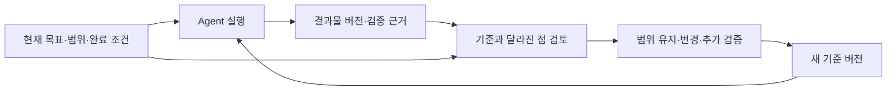

**구현 방향 정정:** 이 문서의 개인 Phase 검토 페이지·인수 실험 제안은 분석가 가설입니다. 사용자 원래 목적은 여러 개인 환경의 기록을 모아 중앙에서 목표·중간 단계·결과 연결을 모니터링·관리하는 것입니다. 제품 목적의 정본은 [PRODUCT-INTENT.md](PRODUCT-INTENT.md)입니다. 기존 분석 내용은 기록으로 보존하며 목표 변경 승인으로 해석하지 않습니다.

**AI PMS 심층 검토 — 결정·실행·결과의 연결을 제품으로 만들 수 있는가**

2026-09-30 | 공개 1차 자료 조사, 전문가 모임 기록 수집, 독립 AI 분석 3개 및 교차검토 1회

현재 판정은 **조건부 탐색 진행**이다. 훅을 이용한 이력 수집은 구현 가능하다. 다만 별도 AI PMS의 수요와 훅 수집의 추가 가치는 아직 검증되지 않았다. 첫 실험에서는 실제 프로젝트의 범위·결과를 검토하는 일을 대상으로, 기존 도구와 간단한 템플릿을 넘어서는 이득이 있는지 확인해야 한다. 범용 PMS를 만드는 결정은 이 실험 뒤에 내려야 한다.

이 문서에서 사실은 직접 확인한 공식 문서·연구·공개 발언의 내용이며, 제품 설계와 고객 선정은 분석가의 제안이다. 실제 고객 면담·전문가 섭외·제품 설치·운영 실험은 수행하지 않았다. 세 AI 분석가는 별도 컨텍스트에서 같은 입력으로 초안을 작성하고, 모두 완성된 뒤 서로 읽었다. 같은 문제 설정과 모델 계열의 편향은 남으며, 세 의견의 일치는 시장 증거 세 개가 아니다.

**처음 제안에서 더 따져야 할 부분**

사용자의 구상은 `각 환경에서 자동 관찰 → 공통 기록 → 중앙 시각화`이다. 이것은 사람들이 일지를 직접 쓰지 않아도 이력을 확보하는 현실적인 수집 경로다. 그러나 이 경로가 사용자의 모든 질문에 답하지는 않는다.

| 사용자가 알고 싶은 것 | 필요한 정보 | 실행 로그의 기여와 빈칸 |
|---|---|---|
| 무엇을 만들기로 했는가 | 승인된 목표, 포함·제외 범위, 성공 조건 | 대화 속 요청은 보일 수 있지만 탐색·제안·합의를 구분해야 함 |
| 왜 범위를 바꿨는가 | 변경 이유, 이전 기준, 결정한 사람 | 코드 변경은 관찰 가능. 회의·메신저·머릿속 판단은 없을 수 있음 |
| 현재 Phase는 어디인가 | 단계의 목표, 진입·종료 조건, 현재 기준 버전 | 시간대나 도구 종류를 묶는 것만으로 단계 확정 불가 |
| 어떤 Agent와 결과물이 연결되는가 | 실행 식별자, 작업 배정, 결과물 버전 | 연결 단서는 확보 가능. 공유 작업 공간의 동시 수정은 귀속이 모호할 수 있음 |
| 다음에 무엇을 결정해야 하는가 | 남은 조건, 실제 증거, 권한·책임자 | 요약과 질문 제안 가능. 책임자가 없거나 판단 능력이 부족하면 도구만으로 해결 불가 |

여기에는 다른 네 문제가 섞여 있다. 과거 맥락을 찾기 어려운 문제, 합의한 내용이 불명확한 문제, 결과를 검증하기 어려운 문제, 여러 사람·Agent가 함께 일하며 기다리는 문제다. 각각의 해법은 검색·기억, 결정 기록, 검증 지원, 업무 조정으로 달라진다. 고객이 무엇 때문에 시간을 잃는지 확인하기 전에 모두를 PMS라는 범주에 넣으면 범위가 지나치게 커진다.

‘AI 때문에 기획·계획의 가시성이 현저히 낮아졌다’는 시장 전반의 인과 주장은 이번 조사로 확정하지 못했다. 일부 팀에서는 구조화된 명세가 오히려 늘고 있다. 처음부터 계획을 덜 세운 팀, 도구가 분산된 팀, 검수 역량이 부족한 팀도 구분해야 한다. 사용자 관찰을 검증 가능한 가설로 바꾸면 다음과 같다.

> AI가 작업을 수행하는 속도에 비해 목표·범위·검증 근거를 함께 이해하는 속도가 느린 팀에서는, 합의와 실제 결과의 연결이 끊어져 재확인과 재작업이 발생한다.

이 가설은 실제 사건의 재구성과 시간·오판 측정으로 검증할 수 있다. 문서 수나 Agent 실행 수는 대체 지표가 되기 어렵다.

**공개된 실제 전문가 모임과 실무 견해**

| 자료 | 확인한 내용 | AI PMS에 주는 시사점과 한계 |
|---|---|---|
| [Thoughtworks Utah retreat 공식 결과](https://www.thoughtworks.com/about-us/events/the-future-of-software-development), 2026-02-01~03; [17쪽 결과 보고서](https://www.thoughtworks.com/content/dam/thoughtworks/documents/report/tw_future%20_of_software_development_retreat_%20key_takeaways.pdf) | 생성된 작업을 지시·평가하는 감독 업무, 결정 처리량, 역할 간 공통 이해를 논의. 역할과 미래상에 단일 합의는 없었음 | 공유된 판단 자료가 필요한 이유를 설명한다. 참가자 견해의 종합이며 대표성 있는 수요 조사 아님. 익명 발언을 특정 유명 인사에게 귀속하면 안 됨 |
| [Thoughtworks Europe retreat 공식 결과](https://www.thoughtworks.com/about-us/events/the-future-of-software-development-europe-2026), 2026-06-28~30 | 검증 병목, harness 운영 책임의 미합의, 경영진과 엔지니어의 기대 차이를 보고 | 관리 화면은 생성량보다 확인할 조건과 책임을 드러내야 한다는 설계 추론을 뒷받침. 새 PMS 구매의사나 특정 방식의 효과는 미확인 |
| [Joshi·Parsons·Fowler 공개 대담](https://martinfowler.com/articles/convo-what-how.html), 2026-01-21 | 요구와 구현이 반복적으로 서로를 바꾸며 구체적 사용 시나리오에서 이해가 발전한다는 논지 | 계획 변경을 모두 이탈로 간주하면 학습을 방해한다. 변경 이유·근거·적용 범위를 보존해야 한다는 시사점. 효과 실험은 아님 |
| [Armin Ronacher, The Final Bottleneck](https://lucumr.pocoo.org/2026/2/13/the-final-bottleneck/), 2026-02-13 | 생성량이 검토 처리량을 넘을 때 대기열과 책임 문제가 발생한다는 현업 관찰 | 알림·승인 카드를 늘리는 제품도 같은 병목을 만들 수 있음. 개인의 관찰이며 발생률 통계는 아님 |
| [Simon Willison의 인터뷰 회고](https://simonwillison.net/2026/May/6/vibe-coding-and-agentic-engineering/), 2026-05-06 | Agent의 신뢰성과 인간의 책임, 실제 사용을 통한 확인을 논의 | Agent의 완료 선언과 사람이 결과를 받아들이는 판단을 구분할 이유. 보편적 개발자 행동의 증거는 아님 |

실증 연구도 과장해서 읽으면 안 된다. [CHI 2025의 지식근로자 연구](https://www.microsoft.com/en-us/research/publication/the-impact-of-generative-ai-on-critical-thinking-self-reported-reductions-in-cognitive-effort-and-confidence-effects-from-a-survey-of-knowledge-workers/)는 319명의 936개 사례를 통해 검증·통합·감독으로 사고 활동이 이동하는 양상을 보고했지만 자기보고 설문이다. [DORA의 사용자 중심성 해설](https://dora.dev/capabilities/user-centric-focus/)도 AI와 조직 성과를 연결하는 맥락이지 이 PMS의 개입 효과가 아니다. [METR의 2026년 후속 공지](https://metr.org/blog/2026-02-24-uplift-update/)는 선택 편향과 병렬 작업 시간 측정 문제를 인정한다. 과거 생산성 수치를 현재의 모든 도구·비개발자에게 적용하지 않는다.

**독립 초안에서 나온 판단**

| 고유 책임 | 초기 결론과 핵심 근거 | 취약한 가정·반증 조건 | 확신도·다음 증거 |
|---|---|---|---|
| 업무: 누구의 어떤 결정을 개선하는가 | 범위 수용과 결과 인수 전 확인에 집중. 연구·현업 기록은 검증과 이해의 부담을 시사 | 자료 탐색이 실제 병목이라는 가정. 체크리스트로 같은 효과가 나거나 문제 원인이 검수 역량이면 반증 | 방향은 Likely, 고객 수요는 Unverified. 최근 실제 실패·성공 인수 사례 필요 |
| 기술: 로그가 무엇을 증명하는가 | 관찰·해석·승인을 구별하고 결정·결과물 버전을 연결. 공식 훅 문서에 누락·비동기·식별 범위 한계 | 최소 자료로 의미 연결이 가능하다는 가정. 핵심 판단이 계속 미연결이면 훅 중심 접근 축소 | 문서상 기능은 Certain, 구현 품질은 Unverified. 실패 주입·실제 이벤트 대조 필요 |
| 도입: 기존 대안보다 무엇이 나은가 | 기존 도구에 붙는 좁은 검토 업무부터 비교. 직접 관련 제품 6개가 이미 상당 기능 제공 | 새 양식에 돈과 시간을 쓸 이유가 있다는 가정. 기존 PR+AI 요약과 동등하면 별도 제품 근거 약함 | 경쟁 기능 존재는 Certain, 지불의사는 Unverified. 반복 사용·유료 갱신·자료 제공 부담 필요 |

초안 전문: [업무 분석](panel/workflow-initial.md), [기술 분석](panel/architecture-initial.md), [도입·대체재 분석](panel/adoption-initial.md). Certain은 공개 문서에서 확인했다는 뜻이며 제품을 설치해 실제로 실행했다는 뜻이 아니다.

**한 차례 교차검토에서 바뀐 판단**

| 분석가 | 인정한 가장 강한 주장 | 치명적인 약점 | 의견을 바꿀 증거 |
|---|---|---|---|
| 업무 | 기존 승인과 작업 지시를 재사용하고 관찰과 합의를 구분해야 함 | 핵심 합의가 로그 밖에 있으면 카드가 미확인·질문만 늘림. 별도 승인 버튼 필요 전제를 철회 | 승인자·구현자의 총노동과 오판을 기존 체크리스트보다 줄이는 반복 사용 |
| 기술 | 실제로 바꿀 결정을 먼저 특정해야 함 | 사람이 보완해 만든 유료 카드의 성공이 자동 수집의 성공으로 이전되지 않음 | 같은 자료에 훅만 추가했을 때 답변 가능 비율과 총비용이 개선됨 |
| 도입 | 버전과 근거를 연결하는 정확성 조건은 타당함 | 기술적 정합성과 패널 수렴은 제품 수요의 근거가 아님 | 기존 템플릿·카드·로그 추가 카드의 차이와 실제 설치·갱신 행동 |

교차검토 전문: [업무](panel/workflow-cross.md), [기술](panel/architecture-cross.md), [도입](panel/adoption-cross.md). 세 패널의 수렴을 보고 ‘인수 카드가 정답’이라고 확정하지 않는다. 먼저 인수·범위 판단에서 자료 탐색이 병목인지 확인하는 수준으로 결론을 낮췄다.

**기존 제품과의 관계**

아래는 2026-09-30에 읽은 공식 문서의 기능 범위다. 제품 전체에 다른 기능이 없다는 판정이나 비교 사용 결과가 아니다.

| 제품 | 확인한 기능 | 새 제품이 검증해야 할 차이 |
|---|---|---|
| [Entire](https://github.com/entireio/cli) | 훅으로 Agent 세션을 수집하고 커밋·체크포인트와 연결, 검색·재개 | 기록과 변경 이유 검색을 넘어서 특정 업무 판단 시간을 줄이는가 |
| [Augment Intent](https://www.augmentcode.com/blog/intent-a-workspace-for-agent-orchestration) | 계획 검토·승인, living spec, coordinator/implementor/verifier, 병렬 실행과 검토 | 새 실행 환경으로 옮기지 않는 것이 실제로 도입 이득인가 |
| [Linear AI Agents](https://linear.app/docs/agents-in-linear) | 이슈 위임과 활동 추적. Agent에 위임해도 사람의 담당 책임 유지 | 기존 이슈·문서·검토 흐름에서 해결되지 않는 질문이 있는가 |
| [GitHub agent management](https://docs.github.com/en/copilot/concepts/agents/cloud-agent/agent-management) | 여러 Agent 세션 시작·진행 확인·중간 지시, GitHub 업무 흐름 연결 | 기존 저장소 밖의 자료와 비개발자 검토 경험이 필요한가 |
| [Kiro Specs](https://kiro.dev/docs/specs/) | 요구·설계·작업 문서, 수용 기준, 작업 상태 및 의존성 기반 병렬 실행 | 프로젝트별 다른 Frame이 정말 필요한가, 기존 명세 구조로 충분한가 |
| [Vibe Kanban](https://www.vibekanban.com/docs) | 개인·팀 칸반으로 계획하고 여러 코딩 Agent의 작업·diff 검토 | 칸반·다중 Agent UI 외에 무엇이 실제 인수 결과를 바꾸는가 |

경쟁 제품은 ‘기록’, ‘계획’, ‘Agent 조정’을 이미 다룬다. 다중 Agent 지원 자체는 차별화 근거가 약하다. 그렇다고 이 제품들이 범위·책임 문제를 완전히 해결했다고 확인한 것도 아니다. 실제 동일 사례로 비교해야 한다. 중립적 데이터 연결, 역할별 이해, 결정 이력은 후보 가치이며 독점적인 공백이라고 단정할 수 없다.

또한 처음의 ‘각 사용자 환경에 훅 설치’는 타깃 선택과 충돌할 수 있다. [Lovable은 코드의 GitHub 동기화](https://docs.lovable.dev/integrations/github)를 제공하고, [Replit은 내장 체크포인트와 Git 이력](https://docs.replit.com/learn/projects-and-artifacts/version-control)을 제공한다. 이 문서들은 전체 대화와 합의가 외부 로컬 훅으로 전달된다는 증거가 아니다. 웹 제작자가 유력 고객이면 결과물 가져오기·공식 연동·선택적 결정 기록을 포함한 수집 경로를 검토해야 한다. 훅을 설치하기 쉬운 사용자만 골라 원래 고객 가설을 바꾸는 일을 피한다.

**만든다면 어떤 제품이어야 하는가**

장기적으로는 `목표와 범위 정하기 → 실행 관찰 → 바뀐 점 확인 → 근거로 결과 수용 → 다음 작업 기준 갱신`을 이어주는 제품이 되어야 한다. 결정이 바뀌었는데 다음 Agent가 예전 기준으로 일한다면 이력을 잘 보여줘도 반복 오류는 남는다. 확인된 현재 기준을 다음 작업에 전달하는 경로가 결국 필요하다. 다만 읽기 기반 검토의 효과와, Agent의 행동을 바꾸는 개입 효과는 별도로 검증한다.

관리의 중심은 모델 이름이나 세션 수보다 ‘이 결과물을 어떤 기준으로 받아들일 것인가’에 둔다. 이를 위해 작업 목표·Phase·결정·실행·결과물·검증을 연결한다. 사람은 판단의 책임을, Agent 실행은 수행 이력을 가진다. Agent의 persona와 사용 모델과 실행 인스턴스도 동일한 대상이 아니다.

첫 화면의 후보는 한 Phase의 검토 페이지다. 현재 목표 한 문장, 포함·제외 범위, 이전 기준 이후 바뀐 것, 기준별 증거, 아직 답할 질문과 담당자를 보여준다. 사람이 필요할 때만 원문·파일·실행 기록으로 내려간다. 생성된 후보가 100개라면 전부 승인 대기열에 넣기보다 같은 쟁점을 묶고 실제 다음 결정을 막는 항목을 우선해야 한다. 이 우선순위도 효과 검증 대상이다.

‘현재 상태의 원본’은 명시적으로 정한다. 기존 이슈·명세가 합의의 원본이면 새 제품은 해당 버전을 가리킨다. 새 제품이 결정 기록의 원본이 되는 범위도 팀이 선택해야 한다. AI가 실제 구현 내용을 읽고 원래 계획을 자동 수정하면 범위 변경 이력이 사라지므로, 관찰된 상태가 승인된 기준을 덮어쓰게 해서는 안 된다.

**가상의 예약 앱 사례로 확인하는 흐름**

아래는 기능 설명을 위한 합성 예시이며 실제 프로젝트 기록이 아니다.

1. 제품 담당자가 Phase 1을 ‘예약 요청과 관리자 확인’으로 정한다. 결제는 제외하고, 요청 제출·중복 요청 처리·관리자 확인의 수용 조건을 남긴다. 기존 문서의 이 버전을 기준으로 삼는다.
2. 구현자가 Agent A에게 요청 화면을 맡기고 Agent B에게 관리자 기능을 맡긴다. 각 실행이 어느 기준을 보고 시작했는지 기록한다.
3. 결제 관련 파일이 관찰된다. 파일명만으로 범위 변경을 확정하지 않는다. UI 실험인지 실제 연동인지 근거를 찾고, 부족하면 검토 후보로 표시한다.
4. 담당자가 ‘고객 요청 때문에 이번 Phase에 결제를 포함한다’고 명확히 결정하면 이유·변경 항목·주체가 붙은 새 기준을 남긴다. 탐색 중 제안이거나 개인적 의견이면 승인된 기준은 그대로다. 이미 유효한 결정 행위가 있으면 재승인 버튼을 요구하지 않는다.
5. UI 테스트 통과 기록은 당시 코드 버전과 로컬 환경의 근거다. 이후 코드 수정이 있으면 이전 검증으로 새 버전의 완료를 주장하지 않는다. 사용자 흐름 확인이 남아 있으면 해당 조건에 연결한다.
6. 화면은 ‘도구 호출 80회, 완료 90%’ 대신 ‘예약 요청은 확인됨, 중복 처리 근거 없음, 결제는 다음 범위 결정 필요’를 보여준다. 담당자는 추가 검증·범위 조정·수용 중 필요한 판단을 내린다.

이 예시의 가치가 실제 사용자에게 없다면 이를 자동화할 이유도 약하다. 반대로 대화와 커밋을 다시 읽는 시간을 반복적으로 줄인다면, 어떤 입력이 그 효과를 만들었는지 추적해 자동화 대상을 정할 수 있다.

**Frame은 표시 방식과 필요한 정보를 함께 정의한다**

앞선 답변에서 WBS·Gantt·스토리보드·와이어프레임을 켜고 끄는 보기로 단순화한 부분은 부족했다. 각 Frame은 다른 질문과 의미 구조를 필요로 한다.

| Frame | 답하려는 질문 | 추가로 필요한 정보 | 자동화의 경계 |
|---|---|---|---|
| WBS | 목표를 어떤 작업으로 나눴는가 | 목표-작업 계층, 책임, 완료 조건 | 실행 로그에서 작업 후보를 만들 수 있으나 미래 작업과 전체 범위를 확정하지 못함 |
| Gantt | 무엇이 무엇을 기다리며 언제 끝나는가 | 의존성, 기간 추정, 자원·일정 제약 | 실행 시간은 미래 소요 시간이나 납기 약속이 아님. 계획 일정과 관찰된 실행 구간을 구분 |
| 스토리보드·와이어프레임 | 사용자가 어떤 화면·상태·흐름을 경험하는가 | 화면, 동작, 성공·오류 상태, 디자인 버전 | UI 도구·소스·화면 자료가 필요. shell 이벤트만으로 완전한 UX를 복원할 수 없음 |
| 조사·실험 Frame | 어떤 가설을 무슨 근거로 판단하는가 | 질문, 출처, 반증 조건, 평가 기준 | 작성된 보고서는 가설 입증과 다름 |
| 업무 자동화 Frame | 언제 시작하고 예외는 누가 처리하는가 | 트리거, 조건, 예외·인계, 결과 확인 | 프로세스가 실행됐다는 사실과 업무가 해결됐다는 사실을 구분 |

따라서 Frame은 `필수 질문 + 결과물 종류 + 검증/완료 기준 + 보기`로 정의하고, Tool은 정보를 읽거나 일을 실행하는 연결 수단으로 정의한다. AI는 작업 특성에 맞는 Frame을 제안할 수 있지만, 충분한 입력이 없는 그림을 확정된 계획처럼 제시해서는 안 된다. 첫 검증은 앱 개발 Frame 하나로 하고, 두 번째 실제 업무에서 필요한 차이를 확인한 뒤 확장한다.

**기술 구조의 최소 조건**

각 도구의 원시 payload를 억지로 한 양식에 맞추기보다 작은 공통 필드와 출처별 추가 필드를 가진다. 프로젝트·실행·도구·이벤트 식별자, 발생/관찰 시각, 결과물 참조, 어댑터 버전, 수집 범위가 공통 축이다. 의사결정과 검증에는 별도의 의미를 붙인다. 이는 설계안이며 API contract를 생성하거나 변경한 것은 아니다.

| 기록의 성격 | 예 | 보존할 연결 |
|---|---|---|
| 관찰 | 특정 호출에서 테스트 성공 결과가 보고됨 | source event, 대상 버전, 환경 |
| 해석 | 이 변경은 결제 범위와 관련될 가능성이 있음 | 사용한 근거, 추출 방식, 수정 이력 |
| 결정 | 책임자가 기준 v3의 범위 변경을 수용함 | 결정 주체, v2→v3 변화, 이유 또는 이유 미기록 |

관찰 신뢰도와 결정 상태를 하나의 점수로 합치지 않는다. 직접 관찰한 제안도 아직 승인되지 않았을 수 있고, 승인된 범위도 구현 검증이 남을 수 있다. 여러 사람이 다른 범위를 결정할 때 적용 대상과 책임 권한을 확인하고 충돌을 숨기지 않는다.

로컬에서는 훅이 짧게 영속 기록을 남기고 반환하며, 별도 동기화가 필요한 항목을 중앙으로 전송하도록 제안한다. 중앙이 개인 기기에 직접 접속해 파일을 가져오는 방식보다 로컬에서 선별해 보내는 방식이 오프라인·접근권한 관리에 적합하다는 설계 판단이다. 저장된 이벤트는 같은 ID로 재전송하고 중앙에서 중복을 제거한다. 로컬에 저장되기 전의 유실까지 복구한다고 약속하지 않는다.

[Codex 공식 문서](https://learn.chatgpt.com/docs/hooks)는 일부 도구 경로 예외와 transcript 형식의 불안정성을, [Gemini CLI 공식 문서](https://geminicli.com/docs/hooks/reference/)는 종료 훅의 best-effort 성격을 명시한다. 따라서 종료 때만 업로드하는 설계와 모든 실행을 포착했다는 가정은 부적절하다. 실제 지원 범위는 도구·버전·실행 환경별로 확인해야 한다.

발생 시각·관찰 시각과 상관관계 식별자를 구별하는 [OpenTelemetry 로그 모델](https://opentelemetry.io/docs/specs/otel/logs/data-model/)과 결과물·활동·행위자의 관계를 다루는 [W3C PROV-DM](https://www.w3.org/TR/prov-dm/)은 설계 참고가 된다. 하지만 이 표준을 쓴다고 인과관계나 승인 내용이 자동으로 참이 되지는 않는다. 초기에는 일반 데이터베이스의 명시적 ID와 관계로 시작할 수 있다.

원문 수집을 줄이면 의미 추출 능력도 줄어든다. 도구 메타데이터만으로 범위 변경 이유까지 알아내겠다는 약속은 성립하지 않는다. 선택된 짧은 근거, 로컬 해석, 기존 결정문 참조가 후보이며, 무엇이 충분한지는 실험해야 한다. 로컬 원문도 민감할 수 있으므로 수집 허용 범위와 보존·삭제를 정한다. 오래 보존하는 이벤트 참조와 삭제 가능한 내용 payload를 구별하면 이력 유지가 비밀정보 영구 보존을 뜻하지 않게 할 수 있다.

제품 비용에는 저장비뿐 아니라 자료 정정, 도구 업데이트 대응, 고객 설치 지원, 요약·추출 비용이 들어간다. 매 도구 호출마다 LLM 분석을 하기보다 실행 이력 수집과 의미 해석의 빈도를 분리하는 것이 초기 가설이다. 개인별 token·실행 수를 생산성 순위로 바꾸면 어려운 검토 업무와 관찰되지 않는 작업을 왜곡할 수 있어, 첫 화면의 지표로 사용하지 않는다.

**첫 고객은 규모보다 실제 사건으로 모집한다**

초기 후보는 ‘비개발 제품 담당자와 구현·검토 담당자가 함께 있고, 매주 범위나 결과를 서로 확인하는 팀’이다. 2~5명은 모집 가설에 불과하다. 인수가 드물거나 한 사람이 모든 판단을 끝내면 이 효용은 작을 수 있다. 반대로 더 큰 팀이나 웹 제작자가 실제 반복 손실과 지불 행동을 보이면 그 증거에 따라 바꿔야 한다.

면담에서 최근 잘된 사건 1건과 실패한 사건 1건을 함께 재구성한다. 다음 질문은 제품을 소개하기 전에 실제 자료를 보며 사용한다.

1. 마지막으로 범위를 바꾼 건에서 무엇이 바뀌었고, 누가 어디에서 결정했는가?
2. 그 결정을 다른 사람이 알기까지 어떤 확인이 필요했는가?
3. 완료라고 보고받았는데 다시 확인하거나 되돌린 것은 무엇인가?
4. 현재 자료로 목표·범위·남은 확인을 설명하는 데 몇 분이 걸리는가?
5. 기존 이슈·PR·문서·채팅 요약으로 충분했던 사례는 무엇인가?
6. 손실 원인이 정보 부재였는가, 책임자 부재·검수 역량·고객 변심이었는가?
7. 자료를 준비할 사람과 이득을 얻는 사람과 비용을 낼 사람이 같은가?
8. 공유할 수 없는 자료를 빼도 필요한 판단을 할 수 있는가?

설치자는 개발자이고 이득을 보는 사람은 PM일 수 있다. PM가 덜 읽는 대신 구현자가 더 정리한다면 팀 전체의 이득은 없을 수 있다. 두 사람의 비용을 함께 측정한다. 혼자 만드는 사람에게는 책임·승인 기능 대신 맥락 복구가 더 가치 있을 가능성이 있지만, 그것은 별도 제품 가설이다.

**검증을 세 가지 비교로 나눈다**

| 조건 | 제공할 것 | 확인하는 질문 |
|---|---|---|
| A. 강한 기존 대안 | 현재 PR/이슈/문서 + 짧은 체크리스트 + 기존 AI 요약 | 지금도 싼 방법으로 해결되는가 |
| B. 같은 자료의 검토 페이지 | A와 같은 자료를 목표·변경·증거·다음 판단으로 연결 | B−A: 연결과 화면 자체의 추가 효용이 있는가 |
| C. 로그를 더한 검토 페이지 | B에 허용된 실행 로그를 추가 | C−B: 훅이 확보하는 정보가 실제 판단을 개선하는가 |

자료를 더 본 사람의 수작업 능력과 도구 효과를 혼동하지 않도록 조건별 입력을 고정한다. 처음 C는 이미 존재하는 허용 로그로 구성할 수 있다. 해당 환경에 로그가 없으면 ‘미구성’으로 기록하고 나중의 수집 PoC와 구분한다. 같은 사람이 같은 사건을 A→B→C 순으로 읽으면 이미 답을 알게 되므로, 유사 난도의 다른 사례를 배정하거나 서로 다른 검토자가 조건을 모르게 평가한다. 작은 탐색 실험을 인과 효과가 확정된 연구로 부르지 않는다.

측정할 것은 판단 준비시간, 구현자의 자료 선택·정정시간, 추가 질문·실제 검증시간, 중요한 오판, 실제로 완료한 결정, 다음 사건의 자발적 사용이다. 핵심 질문에 근거 있게 답한 비율도 측정한다. 모든 항목을 ‘미확인’으로 두어 오판 0을 만드는 방식은 통과가 아니다. 무시된 제안과 불필요한 보류도 비용에 포함한다.

진행 기준의 예는 6개 적합 팀 중 4개가 두 번 이상 자발적으로 재사용하고, 총 판단 관련 시간이 중앙값 30% 줄며, 중요한 오확신이 늘지 않고, 가격을 제시한 뒤 2개 이상이 실제 유료 연장을 하는 것이다. 이는 시장 통계나 검증된 업계 기준이 아닌, 사전에 정할 의사결정 기준의 제안이다. 실제 기준선과 고객의 작업 빈도에 맞춰 실험 전에 고정한다. 지불의사 발언과 실제 지불·갱신을 구별한다.

수작업 지원이 필요하면 지원자의 시간과 개입 내용을 모두 기록한다. 카드가 팔려도 사람이 회의 맥락을 대신 복원해 주는 서비스가 팔린 것일 수 있다. 자동 초안만으로 같은 질문에 답할 수 있는지와 지원 비용을 별도로 확인해야 한다.

**수집 PoC는 로그의 추가 효용을 확인한 뒤 진행한다**

처음 한 도구의 실제 실행으로 시작하되, 공통 템플릿을 주장하려면 두 번째 도구에서도 같은 시나리오를 통과해야 한다. 기존 Entire 등의 수집 결과를 활용할 수 있는지도 직접 훅을 새로 만드는 안과 비교한다. 설치·신뢰·버전·민감정보 정책이 맞는지는 문서만으로 확정하지 않는다.

| 실패 시나리오 | 필요한 결과 |
|---|---|
| 종료 이벤트 없이 강제 종료·재시작 | 완료로 표시하지 않고 이미 영속화한 이벤트를 복구 |
| 오프라인·재전송·도착 순서 반전 | 중복 노출 방지, 업로드 순서로 원인·결과를 발명하지 않음 |
| 여러 Agent·worktree·동일 파일 동시 편집 | 명시적 연결만 확정, 모호한 귀속은 미확인 |
| 테스트 후 코드 재수정 | 옛 버전의 테스트를 새 버전 완료 근거로 사용하지 않음 |
| 도구 미지원·훅 비활성·신뢰 미설정 | 활동 0으로 숨기지 않고 관찰 범위 밖임을 표시 |
| 구두 범위 변경·불명확한 ‘좋아요’ | 자동 승인으로 승격하지 않음 |
| 합성 비밀 문자열·민감 경로 | 수집 허용 범위 밖의 내용이 전송되지 않음 |

초기 기술 기준의 후보는 알려진 관찰 대상의 수집률, p95 추가 지연, 업무당 정정시간, 버전·귀속 오판 수다. 전체 업무를 안다고 가정한 포괄 수집률을 보고하지 않는다. 기술 PoC 통과는 사용 가치나 유료 수요의 통과가 아니다.

**판정과 다음 행동**

채택한 근거는 세 가지다. 공식 훅은 실행 이력의 일부를 수집할 수 있다. 실제 전문가 논의와 연구에는 검증·감독·공통 이해의 문제를 뒷받침하는 관찰이 있다. 현재 제품들은 이미 기록·명세·Agent 관리 기능을 제공하므로 기존 대안과의 비교가 필수다.

기각한 주장은 ‘로그만 모으면 합의와 현재 Phase가 자동 복원된다’, ‘다중 Agent 대시보드 자체가 새로운 시장이다’, ‘수작업 카드가 팔리면 훅 제품도 팔린다’이다. 각각 입력·책임의 공백, 확인된 대체재, 자동화로 이전되지 않는 서비스 효과 때문에 지금의 근거로는 지지할 수 없다.

남은 가장 강한 반론은 **가치 있는 정보가 도구 밖에 있고, 그것을 수집·정정하는 비용이 줄어드는 판단 비용보다 클 수 있다**는 것이다. 단순한 팀 체크리스트가 충분할 가능성도 남는다. 이 반론은 데이터 모델을 정교하게 만드는 것으로 해소되지 않는다.

| 관찰된 결과 | 제품 방향 |
|---|---|
| B가 A보다 낫지 않음 | 기존 도구의 템플릿으로 좁히거나 해당 문제를 접음 |
| B는 낫지만 C의 추가 이득이 없음 | 기존 자료를 연결하는 기능 검토. 훅 우선 투자는 보류 |
| C가 정확한 판단과 총비용을 개선하고 실제 설치·반복 지불이 발생 | 도구별 수집과 공통 모델에 투자 |
| 필요한 자료 대부분이 웹 도구에 있고 훅 경로가 없음 | 타깃을 유지할 가치가 있으면 수집 경로를 변경 |
| 대부분의 가치가 전문가의 수작업 판단에서 발생 | 서비스로 검증하거나 자동화 범위를 낮춤 |
| 핵심 지연이 책임자·검수 역량·의사결정 구조에서 발생 | PMS로 해결할 범위를 다시 정의 |

지금 실행할 한 가지 다음 행동은 **제품 책임자가 접근 가능한 실제 프로젝트 하나의 최근 범위 변경·결과 인수 사건을 골라 A/B/C 세 조건의 자료를 만드는 것**이다. 완료 조건은 목표·변경 이유·현재 범위·검증 상태·다음 결정의 다섯 질문에 대해 정답과 출처, 답변 시간과 정정 비용을 비교할 수 있게 하는 것이다. 그 다음에 후보 팀으로 같은 실험을 넓힌다. 현재 턴에서는 이 조사와 검증안을 작성했으며 실제 프로젝트 자료 수집·외부 연락·설치는 시작하지 않았다.

관련 기록: [공통 검토 입력](brief.md), [공개 전문가 논의 원장](public-discussions.md), 위 독립 분석·교차검토 6개 파일. 과거 환경 기억은 독립 패널의 오염을 줄이는 검토 방식과 실제 훅 전달을 별도 검증한다는 원칙에만 참고했고, 현행 제품 기능의 근거는 이번에 읽은 공식 자료다.
