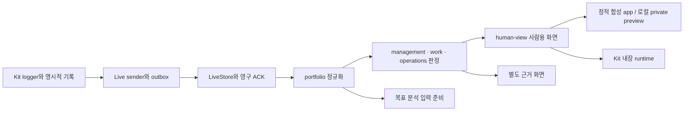

# AI PMS 코드 구조와 정본

Graphify로 프로젝트 코드의 파일·심볼·관계를 추출합니다. 이 안내는 확인한 소스의 책임을 설명합니다. 그래프의 연결선은 실행 중 통신이나 실제 사용자 전달을 증명하지 않습니다.



위 그림은 소스에서 확인한 설계 책임입니다. 정적 앱과 실제 Live service의 데이터 전달 경로는 다릅니다. 실제 provider 훅 신뢰·원격 두 사용자 전달·실제 AI 분석은 별도 인수 대상입니다.

| 책임 | 정본 | 생성본·주의점 |
|---|---|---|
| 제품 목적 | PRODUCT-INTENT.md | 보고서·프로토타입이 목적을 변경하지 않음 |
| 사람용 화면 | specs/ai-pms-dashboard/human-view.js, human-view.css | dashboard.html의 HUMAN VIEW 블록에 동일 원본을 내장 |
| 근거·라우팅·기존 WBS | specs/ai-pms-dashboard/dashboard.html | 원본 모델 판정은 수정하지 않고 화면에 투영 |
| 완료 기준과 작업 판정 | management.py, work.py | 선언/현재 runner/현재 산출물·승인을 구분 |
| 사람·세션·북극성 | operations.py | 종료와 달성, 제안 귀속과 확인 기여, 측정과 선언을 구분 |
| 중앙 집계와 전달 | specs/ai-pms-central/central.py, specs/ai-pms-live/live_service.py, live_sender.py | 영구 기록·ACK와 화면 cursor 변경을 연결 |
| 공개 정적 빌드 | scripts/build_dashboard_app.py | apps/dashboard/public는 합성 데이터로 생성한 결과물 |
| Kit runtime 패키지 | scripts/package_live_kit.py | 명시한 파일만 복사. 실제 로그·자격은 제외 |
| Kit 한영 페이지 | kit/build/current_content.py의 공개 복사본 | 실제 설치의 canonical build가 생성. 생성 HTML 직접 수정 금지 |
| 공개용 분리 snapshot | scripts/prepare_public.py | 기존 home Git 이력·private 실제 자료·graph/cache 제외 |
| 목표 비교 준비 | scripts/prepare_goal_analysis.py | 허용 필드 입력만 생성. 모델 실행·경고 저장은 미구현 |

## 탐색과 갱신

프로젝트 루트에서 실행합니다. 홈이나 여러 개인 프로젝트를 함께 인덱싱하지 않습니다.

```sh
python3 scripts/refresh_project_graph.py
graphify query "LiveStore Sender humanPhase" --budget 1500
graphify query "task_digest check_state derive" --budget 1500
```

`graphify-out/graph.json`, `validation.json`, `GRAPH_REPORT.md`는 로컬 결과입니다. code-only/AST/no-cluster이며 문서 의미 분석이나 외부 모델 호출을 하지 않습니다. 외부 호출 대상을 해석하지 못한 노드는 `unresolved-reference`로 남기고 모든 edge endpoint를 검사합니다. 출처가 없는 참조를 구현된 컴포넌트로 취급하지 않습니다.

생성된 HTML·패키지 사본·테스트도 코드 탐색에 포함되므로 같은 함수 이름이 여러 번 나올 수 있습니다. query의 `src`/`source_location`을 보고 위 정본 파일을 확인합니다. 노드 수·연결 수는 기능 수나 완성도의 지표가 아닙니다. Python의 동적 import, JS 런타임 override, 실제 API 호출 경로는 해당 소스와 실행 검사로 확인해야 합니다.
