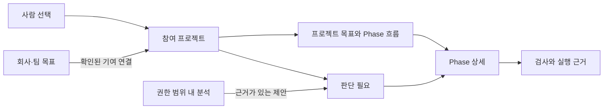

# Rensei 조사와 AI PMS 적용안

조사일: 2026-10-03. 대상: [Rensei](https://rensei.ai), 공개 실행기 [Donmai](https://github.com/RenseiAI/donmai). 공식 설명, 공개 데모, 공개 소스를 현재 PMS 코드와 비교했습니다. 유료 플랫폼 로그인·실행, 독립 성능 측정, 고객 인터뷰는 진행하지 않았습니다. 아래 적용안은 구현 완료를 의미하지 않습니다.

## 판단

Rensei에서 가장 먼저 가져올 것은 **계획의 단계·실행·검증·사람의 결정을 연결하는 구조**입니다. AI PMS는 여러 사람이 각자 선택한 환경과 에이전트로 일하면서 같은 관리 체계에 참여하도록 유지해야 합니다. 중앙 실행기를 모든 사람에게 강제하는 방향으로 바꿀 필요는 없습니다.

우선순위는 네 가지입니다.

1. 프로젝트의 전체 계획과 현재 위치를 보여주는 Phase 흐름. 단계 사이에 완료 조건과 막힌 이유가 연결되어야 합니다.
2. 사람의 판단이 필요한 항목만 모으는 별도 처리함. 승인, 범위 확인, 권한 요청, 반복 실패를 실제 담당자와 다음 행동으로 연결합니다.
3. 계획·테스트·산출물·환경 버전에 연결된 근거. 화면을 간단하게 만들면서도 판정 근거를 잃지 않습니다.
4. 확인된 실패와 결정에서 재사용할 지식을 뽑아 Kit 개선까지 이어지는 루프. 로그의 개수를 생산성으로 환산하지 않습니다.

현재 PMS에는 이 중 상당수의 데이터와 보수적인 완료 판정기가 이미 있습니다. 부족한 것은 근거를 사람이 판단할 단위로 묶는 화면, 분석 결과의 처리 과정, 실제 원격 사용자 환경에서의 수집 검증입니다.

## 1. Rensei가 맡는 일

Rensei의 공식 구조는 선언한 워크플로를 실행 그래프로 만들고, 로컬 실행기와 여러 에이전트 환경을 연결하는 방식입니다. 공개 데모에서는 구현 단계를 접힌 그룹으로 표현하고, 검사 실패를 수정·재검사 또는 사람에게 넘기는 분기로 보여줍니다. 지식 그래프와 실행 중 판단의 출처도 다룹니다. [플랫폼 설명](https://rensei.ai/platform)

이를 세 가지 책임으로 나누면 이해하기 쉽습니다.

| 책임 | Rensei의 접근 | PMS에서의 역할 |
|---|---|---|
| 일을 정의 | 버전이 있는 워크플로, Agent Card, 단계별 산출물 | 사람이 원하는 결과, Phase 목표, 작업 및 완료 조건을 확정 |
| 일을 실행 | Donmai와 플랫폼의 실행·배정·재시도·대기 | 사용자의 기존 도구를 유지하며 기록을 수집. 실행 제어는 선택적으로 추가 |
| 결과를 관리 | 실행 상태, 승인, 근거, 기억 및 평가 | 여러 사람의 목표·진행·막힘·최종 인수와 회사 목표 기여를 판단 |

워크플로 버전은 실행이 시작된 버전에 고정되고 이후 편집과 분리된다고 문서화되어 있습니다. 이 원칙은 계획 변경으로 이전 검사 결과의 의미가 뒤섞이는 문제를 막는 데 유용합니다. [버전 관리](https://rensei.ai/docs/workflows/versioning)

Agent Card는 역할·출력 계약·도구·실행 환경을 버전 있는 선언으로 관리합니다. 다만 제공자가 버전 고정을 지원하지 않으면 최신 버전으로 해석되고 관측 이벤트가 남는다는 예외도 있습니다. 선언한 버전과 실제 적용한 버전을 구분해야 합니다. [Agent Cards](https://rensei.ai/docs/agents/agent-cards/overview)

단계 문서는 조사, 작업 구체화, 개발, QA, 최종 인수를 구분하고 실패 시 refinement를 별도로 둡니다. PMS에는 이 분리 원칙을 적용하되 모든 프로젝트에 동일한 단계 이름과 개수를 강제하지 않는 것이 적합합니다. [Work Types](https://rensei.ai/docs/sdlc/work-types)

## 2. 확인 범위와 제품의 성숙도

공식 근거 장부는 기능 상태와 근거 공개 수준을 나눕니다. 통합 사용자 Inbox, 장기 증거 저장소, 전체 온프레미스는 해당 장부에서 로드맵입니다. 여러 기업용 기능의 근거는 요청 또는 NDA 아래 제공됩니다. 장부의 REV는 2026-09-03이므로 이것만으로 조사일의 실제 제공 상태를 확정할 수 없습니다. [Evidence ledger](https://rensei.ai/evidence)

| 관찰 | 조사 결과를 해석하는 방법 |
|---|---|
| 공개 플랫폼의 그래프와 Inbox | 설계를 설명하는 합성 데모. 실제 조직 데이터와 운영 인수 증거로 사용하지 않음 |
| 웹 문서의 API·내부 함수 설명 | 설계·계약이 문서화되었음을 확인. 실제 서버 동작은 미검증 |
| Donmai 공개 코드 | 특정 로컬 기능의 구현을 읽음. 전체 플랫폼 운영과 보안 감사는 미검증 |
| 문서와 장부의 차이 | 문서상 제공 설명과 날짜가 있는 장부의 상태를 함께 기록. 유리한 쪽만 선택하지 않음 |

예를 들어 기본 템플릿 문서는 GitHub Issues 경로를 설명하지만, 9월 장부에는 일부 이슈 연동이 통합 중으로 남아 있습니다. 현재 지원 범위는 실제 경로를 실행해야 확정됩니다. [기본 템플릿](https://rensei.ai/docs/sdlc/default-template)

가격 행이 없으면 비용 값이 비어 있어 한도를 의미 있게 적용할 수 없다는 제한도 공개되어 있습니다. 비용 설정이 존재하는 것과 실제 제한이 작동하는 것은 다른 검증 대상입니다. [Cost & Caps](https://rensei.ai/docs/agents/agent-cards/cost-and-caps)

`llms.txt`의 일부 제공·인증 표현은 상세 보안 페이지 및 장부와 차이가 있습니다. 구매 판단에는 상세 제한과 실제 데모 확인이 필요합니다. [LLM용 요약](https://rensei.ai/llms.txt), [보안 설명](https://rensei.ai/security)

### 읽은 공개 구현

소스 기준 커밋: [`66fe8f160858aefae8c79b771f05ff97ddd3bddc`](https://github.com/RenseiAI/donmai/tree/66fe8f160858aefae8c79b771f05ff97ddd3bddc). HEAD 확인 후 후속 파일은 이 커밋으로 고정해 읽었습니다. 처음 읽은 `poll.go`, `ack.go`는 HEAD 조회였으므로 완전히 고정된 조사 영수증은 아닙니다. 아래 링크는 같은 시점 기준 커밋을 가리킵니다. 테스트 파일의 존재와 내용을 실행 통과로 표현하지 않았습니다.

| 공개 구현 | 확인한 구조 | PMS에 주는 아이디어 |
|---|---|---|
| [worker/register.go](https://github.com/RenseiAI/donmai/blob/66fe8f160858aefae8c79b771f05ff97ddd3bddc/worker/register.go), [worker/poll.go](https://github.com/RenseiAI/donmai/blob/66fe8f160858aefae8c79b771f05ff97ddd3bddc/worker/poll.go) | 등록과 이후 runtime JWT 사용, 작업 폴링. 에이전트 작업과 배치 작업을 다른 경로로 처리 | 개인 PC의 위치를 중앙이 알아야 할 필요 없음. PC가 외부로 연결. 로그 분석 실패가 개발 작업을 중단시키지 않도록 분리 |
| [sessionshim/ack.go](https://github.com/RenseiAI/donmai/blob/66fe8f160858aefae8c79b771f05ff97ddd3bddc/sessionshim/ack.go) | 세션·shim·프로세스 세대에 묶인 durable ACK, 엄격한 읽기와 파일 권한 확인 | 재시작 이전 ACK를 새 프로세스에 잘못 적용하지 않도록 출처와 세대 보존 |
| [sessionshim/flowcontrol.go](https://github.com/RenseiAI/donmai/blob/66fe8f160858aefae8c79b771f05ff97ddd3bddc/sessionshim/flowcontrol.go) | 대기 바이트와 배압 상태를 별도 파일로 표현. 기존 닫힌 스키마 호환성 고려 | 전송 밀림·저장소 포화·호환 불가를 작업 실패와 구분. PMS 관측기 때문에 사용자의 개발을 멈추게 하는 정책은 별도 결정 |
| [daemon/control_auth.go](https://github.com/RenseiAI/donmai/blob/66fe8f160858aefae8c79b771f05ff97ddd3bddc/daemon/control_auth.go), [위협 모델](https://github.com/RenseiAI/donmai/blob/66fe8f160858aefae8c79b771f05ff97ddd3bddc/docs/THREAT-MODEL.md) | 로컬 변경 요청의 인증과 필수 토큰 부재 시 차단. 같은 OS 계정은 신뢰 경계 안 | loopback만으로 인증 완료라고 하지 않음. 사용자 PC의 실행 권한과 중앙 관리자 권한을 구분 |
| [runtime/mcp/server/tools.go](https://github.com/RenseiAI/donmai/blob/66fe8f160858aefae8c79b771f05ff97ddd3bddc/runtime/mcp/server/tools.go), [MCP 계약](https://github.com/RenseiAI/donmai/blob/66fe8f160858aefae8c79b771f05ff97ddd3bddc/docs/CODE-INTELLIGENCE-MCP-CONTRACT.md) | 여섯 코드 탐색 도구의 호출 구현, 중복 검사 파일의 root 제한, 고정된 도구 프로필 계약 | MCP 이름만 저장하지 않고 제공자·프로필·프로토콜 버전·지원 기능을 식별. 코드 유사성과 목표 중복은 별개 |
| [worktree 설명](https://github.com/RenseiAI/donmai/blob/66fe8f160858aefae8c79b771f05ff97ddd3bddc/runtime/worktree/README.md) | 세션 작업 공간, 소유권 상실, 동시성 및 정리 책임을 문서화 | 세션이 수정한 산출물과 책임 범위 추적. 서로 다른 폴더나 worktree는 보안 sandbox의 증거가 아님 |

공개 저장소는 alpha로 안내합니다. 실행기 소스가 공개되어 있다고 상용 워크플로 편집기·정책·조직 관리까지 그대로 자체 호스팅할 수 있다고 결론 내릴 수 없습니다. [Donmai README](https://github.com/RenseiAI/donmai)

### 직접 도입하는 세 가지 방법

| 방법 | 얻는 것 | 부담과 현재 판단 |
|---|---|---|
| 설계 원칙을 PMS에 적용 | 기존 데이터와 사용자 환경을 유지하면서 관리 경험 개선 | 가장 먼저 권장. 이번 보고서의 20개 적용안 |
| Donmai를 선택 실행 adapter로 연결 | 실행을 맡기는 사용자에 한해 세션·작업 공간·배정 관측 확대 | alpha 버전 고정, 이벤트 매핑, 인증·실행 권한·업데이트 책임 검토 필요. 원격 수집 인수 후 한 프로젝트로 실험 |
| 상용 Rensei를 도입 | 워크플로 실행 및 정책 관리까지 외부 제품에 맡기는 선택 | PMS와 책임 중복, 비용, 데이터 보존·반출·지원 범위 검토 필요. 공개 자료만으로 구매 추천은 보류 |

상용 가격은 공개 정액표가 아니라 범위 협의 방식이며 self-serve는 아직 제공하지 않는다고 안내합니다. 파일럿 결과물을 남기는 방식은 참고할 만하지만 실제 계약·가격을 확인한 것은 아닙니다. 공개 경계표도 로컬 실행기와 상용 제어면을 구분합니다. [가격·파일럿 조건](https://rensei.ai/pricing), [오픈소스 경계](https://rensei.ai/open-source)

상용 검토를 한다면 데모에서 다음을 직접 요청할 가치가 있습니다: 서로 다른 두 PC의 기록 누락과 재연결, 현재 계획 변경 뒤 이전 승인의 처리, 기본 템플릿에서 검사 실패를 완료로 처리하지 않는 경로, 조직 간 읽기 권한, MCP 자원별 근거와 민감 데이터 보존, 내보낸 기록으로 현재 상태를 재구성하는 과정. 보여주는 자료가 합성인지 실제 실행인지도 확인해야 합니다.

## 3. 현재 PMS와 연결할 지점

다음은 이번 조사에서 실제 소스를 읽어 확인한 내용입니다.

| 현재 파일 | 이미 있는 것 | 추가 가치 |
|---|---|---|
| [work.py](../../specs/ai-pms-dashboard/work.py) | 계획 버전, 작업 의존성, 작업/Phase 검사, 현재 산출물에 묶인 검토, 개입 항목 | 기존 판정 결과를 흐름과 처리함에 투영. 새로운 완료 점수 도입은 불필요 |
| [management.py](../../specs/ai-pms-dashboard/management.py) | 목표·요구사항·테스트 계획·시도·막힘·개선·하네스·추적 근거 계약 | 테스트 계획이 왜 만들어졌는지와 수정 이유를 사람이 따라갈 수 있도록 연결 |
| [operations.py](../../specs/ai-pms-dashboard/operations.py) | 사람/환경/세션, 명시한 목표, 별도 세션 생명주기와 완료, 북극성 측정·기여 확인·수집 상태 | 세션 종료와 목표 달성을 혼동하지 않는 화면. 회사 목표는 측정값으로 표시 |
| [live_sender.py](../../specs/ai-pms-live/live_sender.py), [live_service.py](../../specs/ai-pms-live/live_service.py) | opt-in 발신, 개별 변경, outbox, 영구 ACK, 충돌·격리, cursor 기반 변경 조회 | 새로운 전송 체계를 만들기 전에 실제 원격 두 사용자 환경으로 인수 |
| [human-view-and-analysis.md](../../docs/human-view-and-analysis.md), [prepare_goal_analysis.py](../../scripts/prepare_goal_analysis.py) | 최소 화면 원칙, 로그별 분석 목적, 허용 필드 목표 비교 입력 생성 | 실제 모델 분석·근거 검증·수락/기각·효과 확인의 다음 단계를 설계 |

따라서 현재를 “JSON 파일을 한꺼번에 읽는 데모만 있다”로 설명하는 것도 부정확합니다. 개별 전달과 증분 갱신 구현은 있습니다. 다만 공개 Vercel 화면은 정적 합성 샘플이며, 실제 앱 훅의 신뢰와 서로 다른 원격 두 사용자 전달 인수가 남아 있습니다. 그 경계를 넘었다고 표현하지 않습니다.

## 4. 적용할 아이디어 20개

아래는 Rensei의 접근에서 착안한 **PMS 제안**입니다. Rensei가 모든 항목을 구현했다는 뜻이 아닙니다. 우선순위는 임의 점수 대신 의존성과 사용자 효용으로 정했습니다.

### A. 사람이 전체 계획과 다음 판단을 이해하도록

| 번호 | 제안 | 관리자가 얻는 것 | 적용·인수 조건 |
|---|---|---|---|
| 1 | Phase 흐름을 기본으로, 날짜가 있을 때 WBS Gantt 제공 | 전체 계획·현재 단계·남은 완료 조건 파악 | 계획에서 생성. 날짜 없는 항목에 가짜 일정·ETA 금지. 의존성은 실제 선언만 사용 |
| 2 | Phase 안의 원자 작업을 접고 상세 페이지에서 펼침 | 첫 화면은 단순하고 필요할 때 담당 작업까지 확인 | 기본 노드: 단계 이름·목표·상태. 클릭 후 별도 경로. 모바일은 단계 목록과 같은 의미 보장 |
| 3 | 단계 사이의 검사·검토 조건 표시 | “개발은 끝났는데 왜 다음 단계로 못 가는가” 확인 | 현재 산출물·검사·승인으로 판정. 세션 종료나 커밋만으로 통과 처리 금지 |
| 4 | 판단 필요 처리함을 프로젝트 화면과 분리 | 관리자가 자신이 해야 할 일만 확인 | 현재 `interventions` 활용. 이유·영향·담당자·가능한 행동·관련 단계 링크 필수 |
| 5 | 상태 변경으로 목록 위치가 계속 바뀌지 않게 함 | 다수 사용자 작업을 놓치지 않고 추적 | 기본 정렬 안정적 유지. 긴급도는 표시로 전달. 사용자 선택 정렬·완료 보관은 명시적으로 제공 |
| 6 | 세션을 Phase에 종속된 실행 이력으로 연결 | 같은 목표의 구현·QA·재시도를 한 작업으로 이해 | 한 세션이 여러 작업을 다룰 수 있음. Phase·세션 일대일 가정 금지. 사람 필터와 공동 프로젝트 참여자 유지 |

Rensei 공개 화면에서 확인한 설계 힌트는 단계 그룹, 검사 실패 분기, 고정 위치 Inbox입니다. Inbox 자체는 장부상 로드맵이므로 여기서는 설계 참고로 사용합니다. [공개 데모](https://rensei.ai/platform), [기능 상태](https://rensei.ai/evidence)

### B. 계획과 검증의 의미를 보존하도록

| 번호 | 제안 | 관리자가 얻는 것 | 적용·인수 조건 |
|---|---|---|---|
| 7 | 계획 초안·확정·실행 버전 분리 | 무엇을 기준으로 실행·검사했는지 확인 | 현행 계획 버전 기반. 변경된 항목만 비교하고 이전 실행의 기준을 덮어쓰지 않음 |
| 8 | 테스트 계획의 생성·수정 이유를 요구사항에 연결 | “이 검사가 원래 목표의 무엇을 검증하는가” 확인 | 기준 ID·계획 버전·문서 근거·변경 사유. 테스트 통과율을 목표 달성률로 자동 환산하지 않음 |
| 9 | 실패→수정→재검사 묶음 | 동일 실패 반복과 해결 여부 판단 | attempt ID와 산출물 revision 연결. 실행하지 않은 수정 설명은 해결 증거가 아님 |
| 10 | 재시도·시간 한도와 사람에게 넘길 조건 | 끝없는 반복을 조기에 발견 | 프로젝트별 선언과 실제 관측을 구분. 훅만 있는 환경은 차단이 아닌 경고. 실행 제어 가능한 adapter만 강제 |
| 11 | 오래된 승인·시간 만료를 명시적으로 처리 | 변경 이전 승인으로 현재 작업이 통과하는 문제 방지 | 산출물·계획·근거 버전에 묶인 승인. 시간 만료는 재확인 또는 escalation. 자동 승인 기본값 금지 |

Rensei의 gate 문서는 대기와 재개, 오래된 승인 재진입 방지를 설명합니다. 동시에 자동 승인 timeout 예시와 분기 없는 gate의 동작을 명시하므로 그대로 복제하면 안 됩니다. 반복 실행 문서는 상한과 회차별 기록을 설명합니다. [Gates](https://rensei.ai/docs/workflows/runtime/gates), [Loops](https://rensei.ai/docs/workflows/runtime/loops)

### C. 각 PC에서 생성된 기록을 신뢰할 수 있게 전달하도록

| 번호 | 제안 | 관리자가 얻는 것 | 적용·인수 조건 |
|---|---|---|---|
| 12 | 훅은 로컬 저장, 발신기는 외부로 연결 | PC 위치와 내부 webhook 접근 문제 해소 | 사용자별 명시적 중앙 참여. 로컬 개발은 중앙 연결 없이 계속 가능. 기존 sender 우선 활용 |
| 13 | 저장한 기록과 화면 갱신 신호 분리 | 재연결 후 누락 없이 같은 상태 복구 | 저장·ACK 후 갱신 알림. 현재 cursor 조회 우선. SSE 추가 시에도 cursor/reset과 초기 snapshot 필요 |
| 14 | 수집 건강을 작업 상태와 별도로 관리 | 미사용·오프라인·기록 실패·전송 밀림을 구분 | 마지막 기록/ACK, 대기량, 오류, 지원 이벤트 범위. 활동 없음만으로 훅 장애 판정 금지 |
| 15 | 적용된 Kit·스킬·모델·MCP 버전의 환경 영수증 | 특정 환경에서 반복되는 문제를 설명 | 설치·설정·실제 적용을 분리. 원문 프롬프트와 비밀값 전량 업로드 금지. 알 수 없는 버전은 unknown |
| 16 | MCP/Data source 관측 수준과 사용 단계 연결 | 어떤 내부 맥락에 의존했는지 확인 | 설정/요청/호출 성공/데이터 획득/사용 선언을 구분. 자원 식별자는 허용 목록 기반. 결과 원문 기본 제외 |

Rensei의 SSE 문서는 실시간 이벤트가 임시 신호이며 과거 replay가 없고 영구 근거는 별도 행에 있다고 명시합니다. 우리에게 필요한 것은 화려한 streaming 표시보다 재연결 후 일관성입니다. [Execution Streaming](https://rensei.ai/docs/workflows/runtime/execution-streaming)

### D. 로그를 개선과 조직 판단으로 연결하도록

| 번호 | 제안 | 관리자가 얻는 것 | 적용·인수 조건 |
|---|---|---|---|
| 17 | 분석 결과에도 모델·입력 버전·근거·판단 이력 기록 | 어떤 정보로 왜 경고했는지 확인 | finding ID, 대상 ID/버전, 증거 링크, 이유, 행동 제안, 수락/기각. 근거 변경 시 재분석 또는 만료 |
| 18 | 반복 실패·결정·해결을 재사용 지식으로 승격 | 다음 사람이 같은 문제에 덜 막힘 | 검토된 사례만. 프로젝트/조직 접근 범위, 최신성, 반례, 실제 사용 피드백 보존. 전체 로그를 무조건 기억으로 저장하지 않음 |
| 19 | 목표 중복·공통 의존성·협업 후보만 제안 | 여러 사람의 중복 투자와 공통 막힘 발견 | 결과·대상·범위·성공 기준 비교. 같은 회사 목표는 정상적인 분업일 수 있음. 코드 중복 검사와 구분 |
| 20 | Kit 변경을 적용 범위와 후속 결과로 평가 | 철칙·스킬·검증 루프를 왜 바꿨는지와 효과 확인 | 개선 제안→검토→버전 배포→관측. 작업 유형·난도 변화와 표본 부족 표시. 사용 횟수·커밋 수로 사람 평가 금지 |

모델을 작업 유형에 따라 선택하고 평가하는 Rensei의 접근은 나중에 분석 모델을 비교할 때 참고할 수 있습니다. 먼저 좋은 결과의 기준과 평가 자료가 있어야 합니다. [모델 선택 계약](https://rensei.ai/docs/model-routing/catalog-and-routing)

## 5. 화면과 데이터의 구체적인 형태

기본 프로젝트 화면은 목표, 참여자, Phase 목표·상태, 참고 API/MCP만 유지합니다. 회사·팀 화면에서는 측정한 북극성 값과 연결된 프로젝트를 봅니다. 테스트 통과나 프로젝트 개수가 사업 목표의 측정값을 대신하지 않습니다.

Phase 흐름은 두 종류의 관계를 구분해야 합니다. 계획상의 작업 의존성은 WBS/DAG이고, 검사 실패 뒤 수정·재검사 이력은 실행 과정입니다. 재시도 때문에 WBS 의존성에 순환을 넣으면 현재 DAG 검증 규칙과 충돌합니다. 원래 계획은 유지하고 시도 이력을 별도로 연결하는 것이 맞습니다.

판단 필요 상세에는 다섯 가지면 충분합니다.

| 항목 | 관리용 예시 — 실제 프로젝트 관측 아님 |
|---|---|
| 요청 | 내부 API 권한 확인 |
| 영향 | “데이터 연결” 단계의 현재 인수 검사 실행 불가 |
| 근거 | 해당 작업·현재 실패 시도·접근 요청 ID |
| 담당 | 요청한 사람, 권한 확인 담당자 |
| 행동 | 담당자 지정 / 범위 수정 / 근거 확인 |

PMS에 실제 권한 부여 기능이 없다면 “권한 승인” 버튼을 만들면 안 됩니다. 가능한 기록 행동만 제공하고 원래 권한 시스템으로 연결합니다. 초기에 일괄 승인은 도입하지 않습니다. 승인 대상의 현재 버전과 권한, 서로 다른 위험도를 먼저 처리해야 합니다.

### 추가 데이터는 좁고 의미 있게

아래는 **설계 초안**이며 현재 JSON 계약이 아닙니다. 구현 시 기존 필드를 재사용하고 새 필드는 계약 변경 검토와 버전 호환 규칙을 거쳐야 합니다.

| 기록 | 최소 의미 | 기본 화면 노출 |
|---|---|---|
| 계획 변경 | 이전/새 버전, 변경 항목, 이유, 확인한 사람 | 변경이 현재 판단에 영향을 줄 때만 |
| 환경 적용 | 선언한 Kit/스킬/MCP 버전, 실제 확인한 버전, 확인 방식 | 평상시 숨김. 관련 막힘에서만 설명 |
| 분석 결과 | 대상과 버전, 근거, 모델, 이유, 제안, 처리·만료 상태 | 수락된 정보 또는 판단이 필요한 후보 |
| 개선 결과 | 적용한 규칙 버전과 범위, 전후 관측, 한계 | 검토된 개선 요약 |

참고한 MCP가 있다는 사실은 해당 정보가 결정을 유발했다는 증거가 아닙니다. 접속 성공, 데이터 수신, 판단에 사용했다는 선언을 각각 보존해야 합니다. 제공자별 훅이 노출하지 않는 항목은 추가 collector나 명시적 기록이 필요합니다. 모든 도구에서 같은 세부 정보를 얻는다고 약속하면 안 됩니다.

## 6. 실제 진행 순서와 합격 기준

### 먼저: 기존 데이터로 화면과 판단 동선 개선

- 기존 상태 판정기를 재사용한 Phase 흐름과 별도 판단 필요 페이지.
- 원격 API나 DB 변경 없이 로컬 합성 사례로 검증.
- 인수: 서로 다른 두 사람이 같은 프로젝트에 참여하는 것이 보임. 사람별 필터와 공동 Phase 담당 범위가 일치함. 실패·재검증·검토 대기·관측 없음이 서로 구분됨. 클릭으로 별도 상세 페이지를 열고 뒤로 돌아왔을 때 선택과 위치가 유지됨. 390px에서도 같은 정보와 행동에 접근 가능.
- 실제 프로젝트에서는 문서에서 가져온 상태와 현재 실행 증거를 계속 구분.

### 다음: 실제 원격 두 사용자 수집 인수

- 기존 sender/receiver로 수행. 외부 배포와 인증·계약 변경은 해당 변경 범위의 검토 후 진행.
- 인수: 두 실제 환경의 지원 앱에서 훅 발생→로컬 기록→outbox→중앙 영구 저장→ACK→화면 변경까지 확인. 네트워크 단절, 재시작, 중복 전송, 기록 중단, 권한 밖 프로젝트를 검증. 손실·거절·격리도 보이게 함.
- SSE는 이 인수의 선행 조건이 아님. 현행 cursor 증분 조회로 먼저 정확한 갱신을 증명.

### 이어서: 좁은 분석 하나를 실제로 닫힌 루프로

- 첫 후보는 목표 중복/협업 제안. 기존 목표 입력 생성기 재사용.
- 사람이 구분한 정상 분업·범위 차이·실제 중복 사례로 평가. 잘못된 경고의 이유도 기록.
- 인수: 허용된 목표만 입력, 근거 없는 제안 거절, 변경 후 제안 만료, 공동 프로젝트의 정상 분업에 대한 반례, 수락/기각 기록과 다시 확인할 경로. 모델 결과가 완료·목표 귀속·권한을 자동 변경하지 않음.
- 새 외부 모델 호출과 결과 저장 계약은 별도 검토 대상. 이번 조사에서는 호출하지 않음.

### 그 이후: 실패 지식과 Kit 개선

- 실제 실패 사례가 쌓인 뒤 반복 막힘과 검증 누락 분석을 추가.
- 개선안이 적용된 Kit 버전과 이후 작업 결과를 연결. 권한 범위 밖 프로젝트 내용은 검색·학습에 섞지 않음.
- Donmai는 필요하다면 선택 실행 adapter로 별도 실험. 기존 Codex·Claude Code·Cursor·Gemini 환경에서 기록만 참여하는 사용자를 배제하지 않음.

## 7. 그대로 가져오지 않을 것

| 항목 | 이유와 도입 조건 |
|---|---|
| 전체 워크플로 편집기 | 현재는 기존 계획을 제대로 보여주는 것이 먼저. 편집기 도입은 상태 계약·발행·권한·버전 관리까지 제품 책임을 확대 |
| 기본 화면의 terminal·CPU·토큰·모델 순위 | 목표·단계·진행 판단을 방해. 특정 운영 문제를 해결할 때 근거 화면에서만 제공 |
| 코드 생존율을 완료·사업 가치로 사용 | 오래 남은 코드가 좋은 코드나 목표 달성을 증명하지 않음. 수정·삭제가 바람직한 경우도 있음 |
| 모델이 다음 작업·완료·조직 귀속을 확정 | 지금의 보수적인 판정과 사람의 목표 책임을 손상. 모델은 근거 있는 제안부터 |
| terminal 전량 녹화와 조직 간 기억 공유 | 필요한 맥락과 민감 원문이 섞임. 보존 목적·접근·삭제·동의 범위부터 결정 |
| 훅 기록만으로 중앙 정책 강제 주장 | 사후 관측과 실행 전 차단의 제어 지점이 다름. 차단을 주장하려면 실제 실행 경로를 제어·검증해야 함 |
| 감사 서명부터 구축 | 서명은 제공된 기록의 변경 탐지를 도울 뿐 기록 누락이나 내용의 진실을 증명하지 않음. 수집 인수와 출처가 먼저 |

Rensei도 서명 검증의 한계를 공개하고, 실행 경로에서의 정책 판단을 설명합니다. 이 범위는 일반 로깅 훅의 능력과 구분해야 합니다. [보안·검증 범위](https://rensei.ai/security)

## 8. 가설을 반박해 본 결과

| 검토한 가설 | 반대 증거 또는 한계 | 판단 |
|---|---|---|
| “오픈소스를 붙이면 기업용 PMS 전체를 얻는다” | 공개 로컬 실행기와 상용 제어면의 범위가 다름. alpha 안내 | 전체 대체 판단 보류. 개별 구조와 선택 adapter 평가 |
| “가장 좋은 Inbox는 이미 운영 검증된 기능이다” | 합성 데모와 날짜가 있는 로드맵 표시 | UX 가설로 채택하되 우리 사용자 동선으로 검증 |
| “실시간 이벤트면 영구 근거와 복구도 해결된다” | SSE에 replay 없음, 별도 영구 실행 기록 | 기존 durable 기록과 cursor 복구를 보존 |
| “이 환경은 계획 버전과 검증부터 새로 만들어야 한다” | PMS 소스에 이미 계획·검사·검토 판정 존재 | 기존 구조 재사용. 화면과 처리 과정 개선 |
| “회사 목표 기여는 에이전트 실행 평가로 대체된다” | 실행 성공은 사업 지표의 변화와 다른 관측 | 명시적 기여 확인과 북극성 측정 유지 |

분류도 점검했습니다. 화면은 사람이 읽고 행동하는 책임, 검증은 상태의 근거, 수집은 근거의 전달, 분석은 개선 제안을 담당합니다. 같은 승인이라도 화면의 처리함과 판정기의 유효성 검사는 역할이 달라 함께 필요합니다. 개인 프로젝트, 공동 프로젝트, 기록만 참여하는 환경, 오프라인 및 근거 없음까지 적용 범위에 포함했습니다.

이번에 작성한 것은 조사와 도입안입니다. 현재 dashboard·Kit·전송 API·배포에는 이 제안의 새 기능을 구현하지 않았습니다. 다음 구현은 위의 첫 단계부터 기존 데이터로 시작하는 것이 적합합니다.
